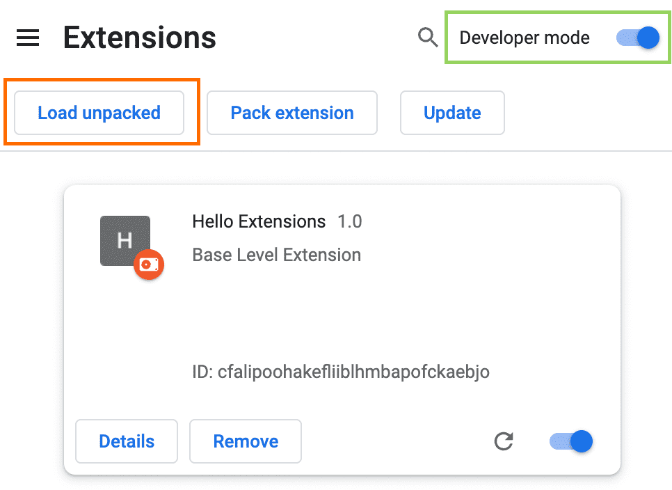
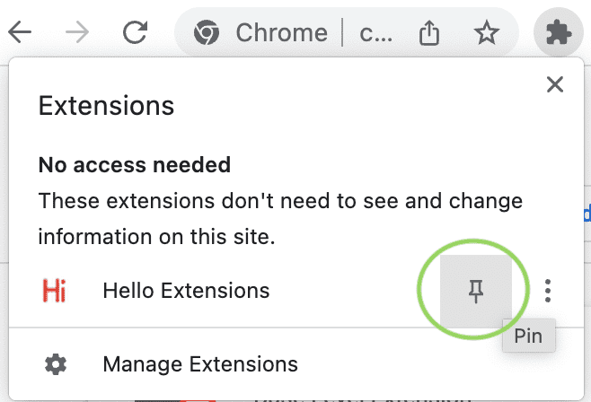
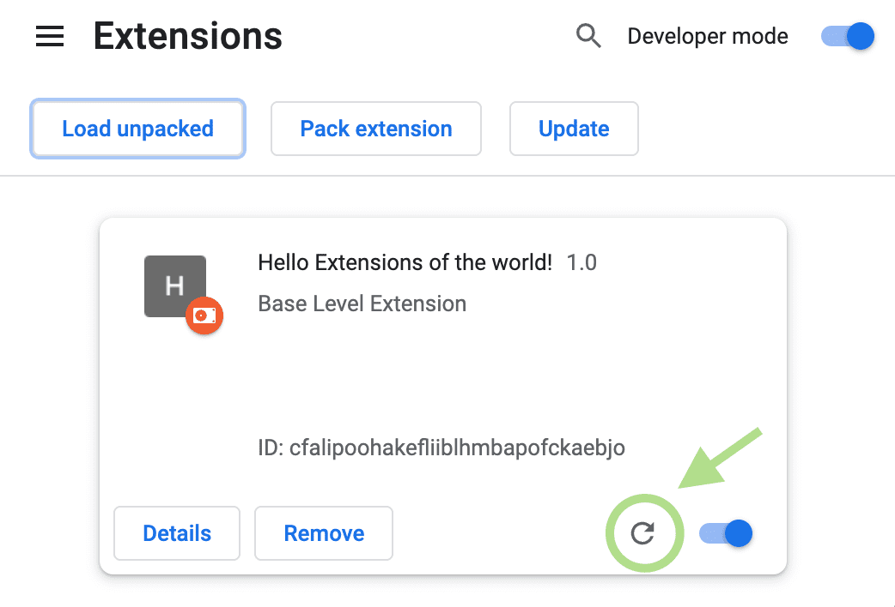

# SABAI Decrypt

Chrome extension that decrypts BYOS-encrypted **supplier and buyer names** directly in your browser — both on the Sabai365 web portal and inside Gmail alert emails sent by Sabai365.

## Why an Extension?

When a BYOS customer's supplier and buyer names are stored encrypted in Sabai's database, they need to be decrypted for display. Baking decryption into the Sabai365 frontend would require the customer to trust that the frontend code isn't exfiltrating the key — and to re-verify this on every release.

This extension is a **small, standalone, auditable codebase** that a third party can review in full. Chrome's [isolated world](https://developer.chrome.com/docs/extensions/develop/concepts/content-scripts#isolated_world) execution model guarantees that the page's JavaScript cannot access the extension's variables or `chrome.storage` — a hard security boundary enforced by the browser, not by Sabai's code.

**Your decryption key never leaves your machine.**

## How It Works

1. The Sabai365 backend prefixes encrypted names (suppliers and buyers) with the marker `⌁ENC:` followed by the AES-256-GCM ciphertext (base64-encoded).
2. The extension's content script scans the page for this marker using a `TreeWalker` and a `MutationObserver` for dynamically rendered content.
3. Each encrypted token is decrypted in-place using the Web Crypto API with the key you configure.
4. The key is stored in `chrome.storage.local`, which is encrypted at rest by Chrome's profile encryption and inaccessible to page JavaScript.

The same prefix is used for both supplier and buyer names — the extension treats them uniformly, since the trust boundary (the encryption key) is the same.

## Encryption Details

| Parameter | Value |
|-----------|-------|
| Algorithm | AES-256-GCM |
| Key derivation | `SHA-256(SECRET_ENCRYPTION_KEY)` → 32-byte key |
| Wire format | `base64(12-byte IV ‖ ciphertext ‖ 16-byte auth tag)` |
| Prefix | `⌁ENC:` (U+2301 + `ENC:`) |

This matches the encryption in [BYOS `relay.ts`](https://github.com/sabai-group/byos/blob/main/src/relay.ts).

## Installation

There are two ways to install the extension:

- **[Install from a release](#install-from-a-release)** — recommended for everyday users. Download a pre-built `.zip` and load it as an unpacked extension.
- **[Build from source](#build-from-source)** — for auditors and developers who want to compile the extension themselves.

Both methods produce the same Chrome MV3 extension; the release zip is built by [this GitHub Actions workflow](.github/workflows/release.yml) directly from a tagged commit, so its contents are exactly reproducible from source.

### Install from a release

#### 1. Download the latest zip

Go to the [Releases page](https://github.com/sabai-group/sabai-decrypt/releases/latest) and download the `sabai-decrypt-vX.Y.Z.zip` asset under **Assets**.

#### 2. Unzip it

Extract the archive somewhere stable on your machine — for example `~/Applications/sabai-decrypt/`. **Do not delete this folder after loading**: Chrome reads the extension's files from disk every time it starts, so the folder must stick around.

#### 3. Open the Chrome extensions page and enable Developer mode

In a new tab, go to [`chrome://extensions`](chrome://extensions) (Chrome blocks `chrome://` links, so you'll need to paste the URL).

Toggle **Developer mode** on in the top right corner, then click **Load unpacked** in the top left.



> Screenshot from the [Chrome for Developers documentation](https://developer.chrome.com/docs/extensions/get-started/tutorial/hello-world), licensed under [CC BY 4.0](https://creativecommons.org/licenses/by/4.0/).

In the file picker, select the **folder you just unzipped** (the one that contains `manifest.json` directly).

#### 4. Pin the extension to your toolbar

Click the puzzle-piece icon in the Chrome toolbar, find **SABAI Decrypt**, and click the pin icon next to it.



> Screenshot from the [Chrome for Developers documentation](https://developer.chrome.com/docs/extensions/get-started/tutorial/hello-world), licensed under [CC BY 4.0](https://creativecommons.org/licenses/by/4.0/).

#### 5. Configure your decryption key

1. Click the **SABAI Decrypt** icon in the toolbar.
2. Paste your `SECRET_ENCRYPTION_KEY` (the same key configured in your BYOS instance) into the input.
3. Click **Save Key**.
4. Reload any open Sabai365 or Gmail tab — encrypted names will now be decrypted automatically.

#### Updating to a newer release

1. Download the new `sabai-decrypt-vX.Y.Z.zip` from the [Releases page](https://github.com/sabai-group/sabai-decrypt/releases).
2. Replace the contents of the folder you originally unzipped (delete the old files, drop in the new ones).
3. Open `chrome://extensions/` and click the reload icon on the SABAI Decrypt card.



> Screenshot from the [Chrome for Developers documentation](https://developer.chrome.com/docs/extensions/get-started/tutorial/hello-world), licensed under [CC BY 4.0](https://creativecommons.org/licenses/by/4.0/).

Your saved key is preserved across reloads.

### Build from source

This path is for auditors and developers — the output is identical to what's published to the Releases page.

```bash
git clone https://github.com/sabai-group/sabai-decrypt.git
cd sabai-decrypt
npm install
npm run package
```

This produces a loadable folder at `dist/`. Then follow [step 3](#3-open-the-chrome-extensions-page-and-enable-developer-mode) onwards above, selecting `dist/` instead of the unzipped folder.

To rebuild after editing source:

```bash
npm run package
```

Then click the reload icon on the extension's card in `chrome://extensions/`.

## Supported origins

The extension only runs on origins listed under `content_scripts[0].matches` in [`manifest.json`](manifest.json):

- `https://*.sabai365.ai/*`
- `https://365.sabai.group/*`
- `http://localhost:5173/*` (Vite dev server)
- `https://mail.google.com/*` (so encrypted names in Sabai365 alert emails are decrypted in Gmail)

If your deployment uses a different host, fork the repo, add it to `matches`, and rebuild.

### A note on Gmail

The extension runs in Chrome's isolated world on Gmail just like it does on Sabai365 — it cannot be observed or interfered with by Gmail's own JavaScript, and your decryption key remains inaccessible to any page script. The content script only modifies text nodes that actually contain the `⌁ENC:` prefix; all other email content is left untouched. Because Gmail re-renders aggressively when switching threads, the `MutationObserver` re-runs the prefix scan on newly added subtrees only, which keeps the cost negligible.

## Development

```bash
npm install
npm run watch    # Rebuild on file changes
```

After a rebuild, click **Reload** on the extension in `chrome://extensions/`.

## Releasing a new version

Releases are built and published by [`.github/workflows/release.yml`](.github/workflows/release.yml) whenever a `vX.Y.Z` tag is pushed.

1. Bump the `version` field in [`manifest.json`](manifest.json) (and `package.json` if you want to keep them in sync).
2. Commit and push to `main`.
3. Tag and push:
   ```bash
   git tag v1.2.3
   git push origin v1.2.3
   ```
4. The workflow will build the extension, zip `dist/` as `sabai-decrypt-v1.2.3.zip`, and create a GitHub Release with that asset attached. The job fails if the tag and `manifest.json` versions disagree.

## Auditing This Extension

The entire decryption logic lives in four files:

| File | Purpose |
|------|---------|
| `src/crypto.ts` | AES-256-GCM decryption via Web Crypto API |
| `src/content.ts` | DOM scanning and in-place text replacement |
| `src/popup.ts` | Key configuration UI |
| `manifest.json` | Extension permissions (only `storage`) |

The extension requests **no network permissions**. It cannot make HTTP requests, so the key cannot be transmitted anywhere. The only permission is `storage` (for saving the key locally).

## License

MIT
